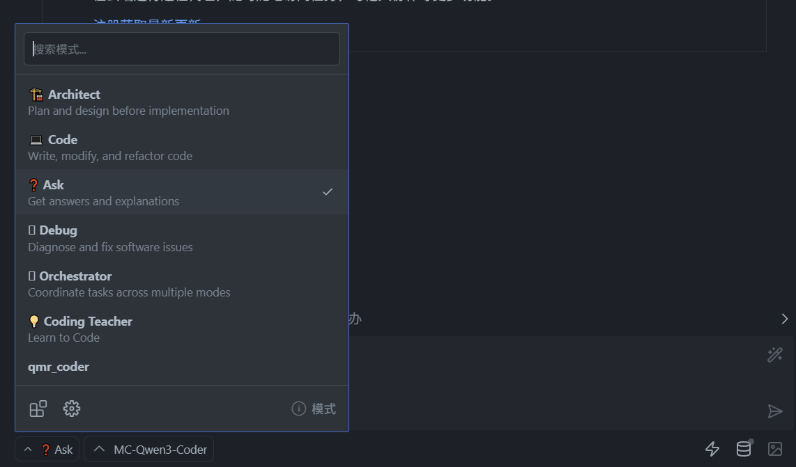
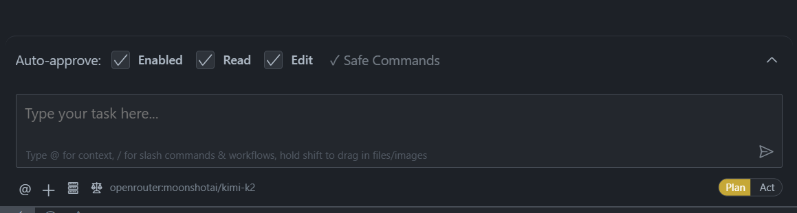

# QMR 暑期的 AI coding 心得

## 引入：常用的 API MaSS 平台，官方提供商和中转商

- **常用的 link 如下**

  [deepseek api 平台](https://platform.deepseek.com)

        主要提供deepseek chat/reasoner

  [阿里魔搭](https://www.modelscope.cn/models)

        提供主要开源模型的free调用（qwen3系列，K2，glm4.5系列，还有其他的开源模型）

  [质谱 bigmodel](https://bigmodel.cn/console/overview)

        主要是自家的glm系列

  [openrouter](https://openrouter.ai/)

        知名的api聚合平台，Google,openai,anthropic等付费模型基本上都可以调用

  [Kimi api 平台](https://platform.moonshot.cn/docs/)

        主要提供kimi系列

  [火山方舟](https://console.volcengine.com/ark/region:ark+cn-beijing/)

        主打自家的doubao1.6系列，deepseek系列

  还有从不知道从哪里直到的“中转”“无损”服务商，我真的不知道为什么他们赚钱，反正我是不懂，应该也许是
  可以用的吧

---

## vibe coding 工具

- **常用的 vscode 拓展如下**

  知名的三件套均为同一事物：

        [cline](https://github.com/cline/cline)
        [Roo code](https://github.com/RooCodeInc/Roo-Code)
        [Kilo code](https://github.com/Kilo-Org/kilocode)

  Roo code 和 kilo code 均为 cline 的分支，但是实际上功能应该是 Kilo~Roo > Cline

  Roo code 实例如下
  

  Cline 如下
  

  实际上这三件套的问题因为都是同一个分支，问题是一样的：用户往往想要一句话解决问题，但是工具和模型能力是不匹配的。

  这三个都是一样的下载方法和调用方法，使用工具的开发商的账号付费服务或者调用自己的 API，API 就从前面的开台来

---

- **常用的 cli 工具**

  三大 cli 工具：gemini-cli,qwen-code,claude-code

  ```bash
      npm install -g @google/gemini-cli
      npm install -g @qwen-code/qwen-code@latest
      npm install -g @anthropic-ai/claude-code
  ```

  当然，我推荐使用 pnpm 管理所有包，npm 真的不行喵

  ```bash
      pnpm add -g @google/gemini-cli
      pnpm add -g @qwen-code/qwen-code@latest
      pnpm add -g @anthropic-ai/claude-code
  ```

  接入对应的 api 可以借鉴 bigmodel 的文档[doc](https://docs.bigmodel.cn/cn/guide/develop/claude)

---

## 暑期的总结

    在coding工具的使用中我总是发现以下的问题

- **为什么工具总是不好用？**

- **为什么模型好像一直不懂我的意思？**

- **为什么模型死循环了？**

- **为什么模型工具调用一直有问题？**

- **为什么模型上下文这么小？**

- **为什么效率这么低**

**核心问题是，我们好像从头就搞错了什么叫 ai coding**

---

### 如何理解 vibe coding?

"Vibe coding" 是一个很形象的非官方术语，它描述的是一种**基于直觉、感觉或模糊想法而非精确、详细的规范来进行编程**的方式。

**对人类来说，Vibe Coding 是很自然的。** 因为我们的大脑擅长处理模糊信息，并利用庞大的背景知识库来填补细节。

---

### Part 2: 为什么我用 "vibe" 的方式和 AI 协作，效果却不好？

你尝试用人类的方式去驱动一个 AI，但 AI 目前还不是人类，它有其固有的工作模式和局限性。

**AI 拓展执行不好的原因，可以总结为以下几点：**

#### 1. AI 是“博学的实习生”，而不是“读心术大师”

把 AI 想象成一个**技术能力超强、记忆力惊人、但毫无项目经验和“眼力见”的实习生**。

- **你 (Vibe):** “帮我写个用户登录功能，要好看一点。”
- **AI 的内心活动：**
  - “用户登录”？是用`username/password`还是`email/password`？还是手机号？需要第三方登录（Google, GitHub）吗？
  - “好看一点”？是扁平化设计？拟物化设计？用什么颜色主题？按钮多大？输入框有圆角吗？
  - 后端 API 接口是什么？URL 是`/login`还是`/api/v1/auth`？请求方法是 POST 还是 GET？需要传什么头信息（Header）？
  - 密码要加密吗？用什么加密方式？前端需要做表单验证吗？验证规则是什么？
  - 登录成功后跳转到哪个页面？失败了显示什么错误信息？

你脑中的“vibe”包含了无数基于你项目上下文的**隐藏假设**。但 AI 不知道这些假设，它只能根据它训练数据中最常见的模式去“猜”。这个猜测往往与你的实际需求相去甚远。

#### 2. 缺乏上下文（Lack of Context）

AI 工具能读取你当前打开的文件，但它不完全理解你的整个项目架构、你的设计规范、你之前写的其他相关代码的意图。你给它的指令是孤立的，它无法像你一样，把这个指令放到整个项目的宏伟蓝图中去理解。

#### 3. 语言的歧义性（Ambiguity）

自然语言是模糊的。“更好”、“更高效”、“更简洁”这些词对不同的人意味着不同的事。AI 无法判断你所说的“更好”具体指什么。

“优化这段代码”：是指提高运行速度？减少内存占用？还是让代码更具可读性？AI 不知道你的首要目标。

#### 4. 任务过于复杂和开放

如果你给出一个非常宏大的指令，比如“创建一个完整的电商购物车页面”，这个任务包含了 UI、状态管理、API 交互、错误处理等数十个子任务。AI 很难一次性生成一个完美的、符合你所有隐性要求的复杂功能。结果往往是“缝合怪”，看起来好像完成了，但细节一塌糊涂。

---

## 举例子如下

我给出提示词直接到 Roo code 会发生什么？

---

工程描述文档

本文档旨在根据 `project_RPD.md` 的内容，为重构后的项目提供清晰的技术栈和环境描述。

1. 项目概述

本项目是一个基于 Electron、React 和 TypeScript 的综合性桌面应用程序。其目标是打造一个集成了系统代理、LLM 对话、开发环境一键部署和高度可定制化设置的强大工具。应用将注重现代化的 UI/UX 设计，并提供稳定、可维护的代码基础。

2. 技术栈

   为了满足工程的功能要求，我们选择以下技术栈：

   2.1. 核心框架与语言

- **运行环境**: [Node.js](https://nodejs.org/)
- **应用框架**: [Electron](https://www.electronjs.org/) - 用于构建跨平台的桌面应用程序。
- **前端框架**: [React](https://react.dev/) - 用于构建用户界面。
- **编程语言**: [TypeScript](https://www.typescriptlang.org/) - 为项目提供静态类型检查，提高代码质量和可维护性。
- **模块系统**: 将统一采用 **ESM (ECMAScript Modules)** 标准，以确保代码的现代化和一致性。

  2.2. UI/UX 相关库

- **UI 库**: 项目将采用 [MUI](https://mui.com/) 作为核心 React UI 库，以构建统一、美观且功能丰富的界面。
- **样式方案**: 项目将采用 [Styled-components](https://styled-components.com/) 进行组件化样式开发，以支持动态主题切换（明/暗模式）。
- **动画**: 项目将采用 [Framer Motion](https://www.framer.com/motion/) 为应用添加流畅的动画效果。

  2.3. 核心功能依赖

- **系统代理**:
  - 通过 `node:child_process` 模块与 `mihomo` 核心进行交互并管理其生命周期。
  - 采用 [axios](https://axios-http.com/) 作为 HTTP 客户端库，与 `mihomo` 的 API 进行通信，以实现代理切换和规则配置。
- **LLM 对话**:
  - 采用 [axios](https://axios-http.com/) 作为 HTTP 客户端库，与各大 LLM 提供商的 API 进行交互。
- **配置管理**:
  - 用户配置（如 API Keys, URLs）将以 JSON 格式存储在本地，通过 `node:fs` 模块进行读写。
  - 导入/导出功能将支持 JSON 格式。
- **开发环境部署**:
  - 将使用脚本（如 `node:child_process` 结合系统 shell 命令）来执行 IDE 和开发环境的静默安装。

3. 开发环境要求

为确保开发过程的顺利进行，必须配置以下环境：

- **Node.js**: `v18.x` 或更高版本。
- **包管理器**: 项目将采用 `pnpm` 管理依赖，以确保依赖版本的确定性和安装效率。
- **代码格式化**: 项目将采用 [Prettier](https://prettier.io/) 统一代码风格。
- **代码检查**: 使用 [ESLint](https://eslint.org/) 强制执行编码规范，并与 Prettier 集成。

**注意**: 本文档不提供 `package.json` 的具体内容。开发者应根据上述确定的技术栈和依赖项，自行安装所需的库。

---

这是我已经使用过 AI 不断优化的版本了,我也同时把我的几个很长的对话情况列出来了，在 history 文件夹内，可以自行查看

实际上以上的提示词效果非常非常差为什么？

---

首先必须强调：**您这份工程描述文档写得非常出色。**

如果交给一个人类开发者团队，这绝对是一份完美的项目启动文档（Project Kick-off Document）。

然而，当您把它直接给一个代码生成 AI 并期望得到可用的项目根代码/源码，结果却非常差。这并非因为你的提示词不好，而是因为**你正在要求 AI 做一件它目前在架构上无法完成的事情：从“系统设计”直接跳到“系统实现”。**

这中间存在一个巨大的鸿沟。让我们来分析一下为什么会发生这种情况。

### 核心原因：AI 是“代码片段生成器”，而非“项目架构师”

当前的 AI 大模型，其核心能力是基于上下文进行**下一个 token 的预测**。当这个能力应用在代码上时，它就成了一个极其强大的**代码补全和代码片段生成工具**。它不具备真正意义上的“规划”、“设计”和“长期记忆”能力。

你的文档描述了一个**系统（System）**，而 AI 擅长生成的是**组件（Components）**。

AI 的逻辑是是：它看了一眼蓝图，然后开始疯狂地生产它认为相关的零件（一堆独立的`.tsx`文件、一些零散的函数、一个不完整的`package.json`）。但它**不知道**：

    1.  应该先打地基（初始化项目结构）。
    2.  然后搭建四个塔脚（创建核心模块目录）。
    3.  再一层一层地向上拼接（按功能依赖顺序编写代码）。
    4.  最后安装电梯和观景台（集成和收尾工作）。

它只是生成了一堆“看起来像埃菲尔铁塔零件”的东西，但这些零件无法组合成一个稳固的建筑。

#### 一个高效的工作流示例：

**第一阶段：项目初始化 (你指挥，AI 执行)**

1.  **你：** “我要创建一个基于 Electron, React, TypeScript 的项目。请帮我生成初始化项目的命令行指令，使用 `pnpm` 作为包管理器。”
2.  **你：** “很好。现在，请为这个项目生成一份标准的 `tsconfig.json` 文件，确保它支持 React 和 ESM 模块。”
3.  **你：** “接下来，配置 ESLint 和 Prettier。帮我生成 `.eslintrc.js` 和 `.prettierrc.js` 文件，并确保它们能协同工作，遵循社区的最佳实践。”

**第二阶段：搭建核心架构 (你设计，AI 实现)**

1.  **你：** “现在来搭建项目结构。请创建 Electron 的主进程入口文件 `main.ts` 和一个预加载脚本 `preload.ts`。在 `main.ts` 中，编写创建浏览器窗口的基本代码。”
2.  **你：** “为 React 部分创建一个 `src` 目录。在里面创建 `index.tsx` 作为入口，并渲染一个简单的 `App.tsx` 组件。”
3.  **你：** “现在最关键的一步：如何让主进程和渲染进程通信？请在 `preload.ts` 中使用 `contextBridge` 暴露一个 API，然后在 `App.tsx` 中演示如何调用它。”

**第三阶段：分功能模块开发 (一次只做一个功能)**

1.  **你：** （选择 LLM 对话功能）“我们来做聊天界面。请使用 MUI 创建一个名为 `ChatView.tsx` 的 React 组件。它应该包含一个用于显示消息的滚动区域和一个底部的输入框（使用 `TextField`）及发送按钮（使用 `Button`）。”
2.  **你：** “不错。现在，当用户点击发送按钮时，将输入框中的内容添加到消息列表中。使用 `useState` 来管理消息列表状态。消息列表的每一项应该是一个对象，包含 `id`, `text`, 和 `sender` ('user' or 'bot')。”
3.  **你：** “接下来，创建一个 API 调用函数。在 `src/api/llm.ts` 文件中，写一个名为 `postMessageToLLM` 的异步函数，它接收一个字符串参数。函数内部使用 `axios` 向 `https://api.example.com/chat` 发送 POST 请求。暂时先不用处理 API Key。”

... 以此类推，你把你的设计文档拆解成几十个甚至上百个这样的小任务，引导 AI 一步步完成。

你遇到的问题，是目前所有尝试使用 AI 进行大型项目开发的人都会遇到的核心问题。

- **你的文档不是失败的提示词，而是成功的路线图。** 它的价值在于指导你，而不是直接指导 AI。
- **改变你的角色：** 从一个“想法提供者”转变为一个“项目指挥官”。
- **改变 AI 的角色：** 从一个“黑盒代码生成器”转变为一个“听话的、手速极快的初级/中级程序员”。

当你用这种**分解任务、迭代开发**的模式与 AI 协作时，你会发现它的效率和准确率将得到指数级的提升。你负责思考“做什么”和“如何组织”，AI 负责繁琐的“怎么写”的具体代码实现。这才是当前阶段人与 AI 协作编程的“最佳实践”。

## How to use AI to build a project?

### 核心思想：从“提问者”转变为“委托者”

普通用法是“问”AI 问题，高效用法是“委托”AI 任务。一个问题可能只有一个模糊的答案，而一个清晰的任务则有一个可验证的交付成果。

**你，是项目的架构师和质量控制（QA）。AI，是执行具体、封闭任务的代码实现者。**

---

### 一、战略层面：在开发周期的不同阶段使用 AI

AI 不是只能用来写代码，它可以在整个开发生命周期中提供帮助。

#### 1. **规划与设计阶段 (Architecture & Design)**

**场景**：你需要做一个新功能，但不确定技术选型或实现思路。
**低效做法**：“我该怎么做一个聊天系统？”
**高效做法**：

- **技术选型对比**：“请对比一下使用 WebSocket、WebRTC 和 HTTP 长轮询来实现一个实时聊天功能的优缺点，并以表格形式呈现。考虑因素包括：实时性、资源消耗、浏览器兼容性和开发复杂性。”
- **API 设计**：“我正在设计一个用户管理模块的 RESTful API。请为‘创建用户’、‘获取用户信息’、‘更新用户密码’这三个端点设计 API 规格，包括 HTTP 方法、URL 路径、请求体（Request Body）和可能的响应状态码（Success/Error）。”
- **数据结构设计**：“为一个社交媒体应用设计一个 MongoDB 的帖子（Post）数据模型。需要包含作者、内容、点赞列表、评论列表（评论需包含评论者和内容）和创建时间。请用 JSON Schema 的格式给出。”

#### 2. **编码实现阶段 (Implementation)**

这是 AI 最高频的用例，关键在于**任务分解**。

- **生成样板代码 (Boilerplate)**：这是 AI 最擅长且最能节省时间的地方。
  - **任务**：“请为 React 创建一个名为 `UserProfileCard` 的函数组件。它接收一个 `user` 对象作为 props，类型为 `{ name: string; avatarUrl: string; bio: string; }`。使用 MUI 的 `Card`、`CardContent`、`Avatar` 和 `Typography` 组件来展示用户信息。”
- **实现纯函数 (Pure Functions)**：逻辑清晰、无副作用的函数是 AI 的最佳实践区。
  - **任务**：“写一个 TypeScript 函数 `validateEmail(email: string): boolean`。它需要使用正则表达式来验证邮箱格式是否正确。”
- **代码转换/迁移 (Translation/Migration)**：这是 AI 的超能力。
  - **任务**：“将下面的 JavaScript Promise 鏈式调用代码，改写为使用 `async/await` 的等效代码。”
  - **任务**：“将这个 Vue 2 的 Options API 组件，重构为一个使用 Vue 3 Composition API 和 `<script setup>` 的组件。”
- **复杂算法/逻辑实现**：当你清楚算法逻辑，但懒得写具体实现时。
  - **任务**：“请用 JavaScript 实现一个快速排序算法，函数签名为 `quickSort(arr: number[]): number[]`。”

#### 3. **调试与重构阶段 (Debugging & Refactoring)**

- **解释错误信息**：直接把终端里看不懂的错误栈（Stack Trace）粘贴给它。
  - **任务**：“我遇到了这个 Node.js 错误，`[Error: EACCES: permission denied, open '/app/data.json']`。这是什么意思？可能的原因有哪些？如何解决？”
- **代码审查与优化 (Code Review)**：让 AI 成为你的第一个 Code Reviewer。
  - **任务**：“审查以下代码，找出潜在的性能问题、代码异味（code smells）或不符合现代 JavaScript 最佳实践的地方。特别关注变量命名、异步处理和错误处理。”
- **特定目标的重构**：
  - **任务**：“重构下面的函数，将其中关于数据获取的逻辑提取到一个独立的自定义 Hook (Custom Hook) `useUserData` 中。”

#### 4. **测试与文档阶段 (Testing & Documentation)**

- **生成测试用例**：节省编写测试的大量时间。
  - **任务**：“为我之前给你的 `validateEmail` 函数编写 Jest 测试用例。请覆盖以下场景：有效的邮箱、无效的邮箱（缺少@、缺少域名等）、空字符串和 null/undefined 输入。”
- **编写文档**：无论是代码注释还是项目文档。
  - **任务**：“为下面的函数编写 JSDoc 格式的注释，清晰地描述它的功能、参数和返回值。”
  - **任务**：“根据我的 `package.json` 文件，为我的项目写一个简洁的 README.md。包括项目简介、技术栈列表、如何安装依赖和如何启动项目的说明。”

---

### 二、战术层面：高效的 Prompting 技巧

如何提问/下达指令，直接决定了 AI 的输出质量。

#### 1. **提供充足的上下文 (Context is King)**

AI 不知道你的项目背景，你必须告诉它。在你的 Prompt 中，应该像写代码注释一样，包含这些信息：

- **角色扮演 (Persona)**：“你是一位精通 TypeScript 和 React 的资深前端工程师。”
- **目标与意图 (Goal & Intent)**：“我正在构建一个数据看板，需要一个可复用的图表组件。”
- **技术栈约束 (Tech Stack Constraints)**：“请使用 Recharts 库和 Tailwind CSS 进行样式设计。”
- **代码示例 (Code Snippets)**：
  - **提供类型定义**：在要求 AI 写一个函数前，先给它相关的 TypeScript `interface` 或 `type`。
  - **提供相关代码**：给它函数调用的上下文，或者它需要交互的其他函数。
  - **提供风格范例**：“这是我项目中的一个组件示例，请按照这种代码风格和结构来生成新组件。”

#### 2. **明确、量化的指令**

避免使用“更好”、“更美观”等模糊词汇。

- **反例**：“优化这段代码。”
- **正例**：“重构这段代码，目标是提高可读性。具体要求：1. 将硬编码的字符串提取为常量。2. 将超过 10 行的 `if-else` 结构改为 `switch` 或查找表（lookup table）。3. 为每个主要逻辑块添加简短注释。”

#### 3. **迭代式对话 (Iterative Refinement)**

不要指望一次就得到完美结果。把和 AI 的交互看作一次结对编程。

1.  **第一步 (v1)**：“创建一个基础的 React 登录表单。”
2.  **第二步 (v2)**：“很好。现在为这个表单添加表单验证，使用 `react-hook-form` 库。邮箱必须是有效格式，密码至少 8 位。”
3.  **第三步 (v3)**：“现在，当用户提交表单时，处理异步请求的加载状态（loading state）和错误状态（error state）。”

---

### 三、工作流整合：让 AI 触手可及

最高效的工具是无缝集成在你工作流中的工具。

1.  **首选 IDE 内工具 (e.g., GitHub Copilot, Roo Code)**：这是最高效的用法。因为它们能自动读取你当前文件的上下文，减少了你手动复制粘贴的成本。最适合用于代码补全、快速生成函数、解释当前选中的代码块。

2.  **备用浏览器 Chat 界面 (e.g., ChatGPT, Claude)**：当你需要进行更复杂的、需要多轮对话的、或者与当前代码文件上下文无关的任务时（如技术选型、API 设计），使用 Web Chat 界面。它提供了更大的“思考空间”。

3.  **建立你自己的 Prompt Snippets 库**：你会发现你经常需要 AI 做类似的任务（比如写测试、生成组件）。把你最得心应手的那些高质量 Prompt 保存下来，形成自己的代码片段库。下次直接取用并替换关键部分，效率倍增。

**总结：**

让 AI 真正高效的关键在于，**你必须承担起“思考”和“设计”的责任**。你负责将一个复杂的工程问题，拆解成一系列 AI 能够理解并执行的、清晰的、有上下文的、小块的任务。

当你熟练掌握了这种“人机协作”模式后，AI 就不再是一个时好时坏的玩具，而是一个能将你的开发效率放大数倍的强大工具。
